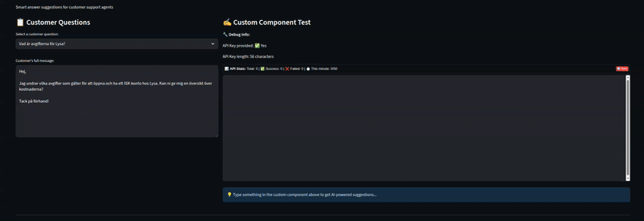

# Auto Complete solution for customer support 
**Remaking this since 20 Aug 2025**

### GOAL OF REPO
##### Personal Goals
- [ ] Learn how to use Streamlit custom components
- [ ] Learn how to build a autocomplete solution for customer support.
- [ ] See if i can intergrate tools to a autocomplete solution.
- [ ] Understand how a autocomplete solution works compared to a normal LLM chatbot. (cost saving streagies)

##### Repo Goals
- [ ] Be able to speed up customer supports ability to answer questions.
- [ ] Make a autocomplete custom component for streamlit other people can use.

#### Future Goals im interested in
- [ ] mabye train a model on customer support data on how to answer questions.
- [ ] mabye add a solution to add templates to the autocomplete solution.
- [ ] Add customer information retrieval to the autocomplete solution. (get customer data from a database)
- [ ] Mabye add a draft first soltuon then a HITL solution where you accept or reject the draft.

### progress so far.

### TODOS: 
- [x] Make it possible to press tab to accept the suggestion.
- [x] The script is hardcoded in streamlit_copilot.tsx to only use the groq api, make it possible to use other apis.
- [x] add cost calculator.
- [x] Give the LLM access to the question we want to answer.
- [x] Handle thinking models (like llama) to hide the thinking process.
- [x] Make it do a request every 500ms after the user stops typing not every time the user types. to reduce cost.
- [ ] Give LLM tools to look in knowledge base.
- [ ] Make this Readme.md better.
